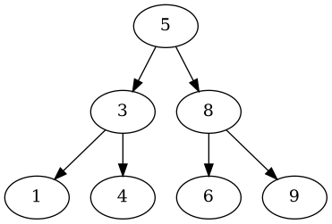

# BST/AVL Tree Visualizer

A Python implementation of a self-balancing AVL tree, built alongside a plain (non-balancing) BST to demonstrate the practical difference balancing makes. Includes an interactive command-line interface and Graphviz-based visual export.

## Features

- **AVL Tree** — full insert, delete, and search, with automatic rebalancing via all four rotation cases (left, right, left-right, right-left)
- **Plain BST** — a non-balancing counterpart for comparison
- **Comparison Mode** — inserts the same sequence of values into both trees and prints them side by side, showing how a plain BST can degrade into a straight line while the AVL tree stays balanced
- **CLI** — insert, delete, search, and print a tree interactively from the terminal
- **Graphviz Export** — renders the tree as a PNG diagram

## Example: AVL vs. Plain BST

Inserting `[1, 2, 3, 4, 5, 6, 7]` (sorted input — the worst case for an unbalanced tree):

```
AVL Tree:
4
2 6
1 3 5 7

Plain BST:
1
2
3
4
5
6
7
```

The plain BST degrades into a straight line (O(n) search in the worst case). The AVL tree stays balanced at height 3 (O(log n) search) with the exact same input.

## Visual Export

```python
tree = BST()
for val in [5, 3, 8, 1, 4, 6, 9]:
    tree.insert(val)

tree.export_graph("my_tree")
```

Produces a PNG diagram of the tree structure using Graphviz.

## Installation

```bash
pip install -r requirements.txt
```

Graphviz export also requires the Graphviz system binary:

- **Mac:** `brew install graphviz`
- **Linux:** `sudo apt install graphviz`
- **Windows:** download from [graphviz.org](https://graphviz.org/download/) and add it to PATH

## Usage

### Interactive CLI

```bash
python cli.py
```

| Command         | Description                  |
|-----------------|-------------------------------|
| `insert <n>`    | Insert a value into the tree  |
| `delete <n>`    | Remove a value from the tree  |
| `search <n>`    | Search for a value            |
| `print`         | Print the tree level by level |
| `help`          | Show command info             |
| `quit`          | Exit                          |

### Comparison Mode

```python
from compare import compare

compare([1, 2, 3, 4, 5, 6, 7])
```

## Project Structure

```
.
├── __init__.py
├── core.py         # AVL tree (Node, BST classes)
├── plain_bst.py     # Non-balancing BST for comparison
├── cli.py          # Interactive command-line interface
├── compare.py       # Side-by-side AVL vs. plain BST comparison
└── requirements.txt
```

## What This Project Demonstrates

- Recursive tree algorithms (insert, delete, search)
- Self-balancing data structures and rotation logic
- Debugging and verifying correctness (e.g. writing a BST-validity checker rather than relying on eyeballing output)
- Working with an external visualization library (Graphviz)
